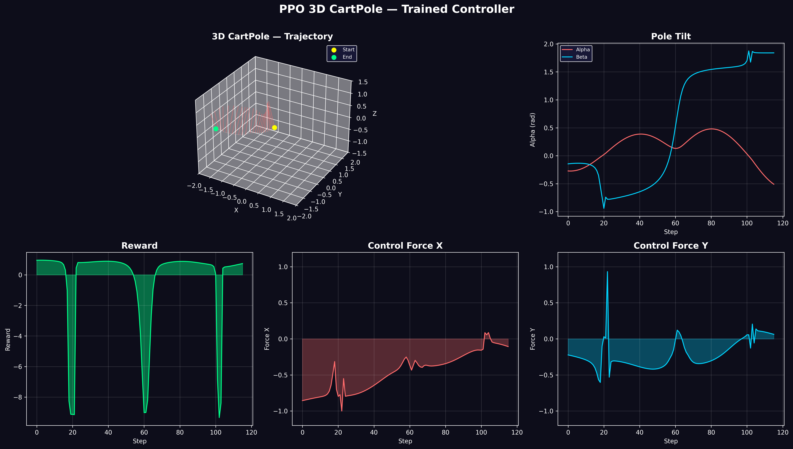

# 3D CartPole — PPO from Scratch with Coupled Lagrangian Dynamics

A fully from-scratch 3D CartPole solved with Proximal Policy Optimization. The pole balances in 3D using spherical coordinates with coupled physics derived from the Lagrangian. Every component — physics engine, neural networks, PPO training loop — built with NumPy. No PyTorch. No TensorFlow. No Gymnasium.




## Video

Go to my LinkedIn, I have posted it there, or you can just download the file.

## Project Structure

```
├── Environment.py          # 3D CartPole physics (Lagrangian, 4×4 mass matrix)
├── ActorAndCritic.py       # Actor and Critic networks (8→128→128→2)
├── TrainModels.py          # PPO training loop with fixed std decay
├── TestModel.py            # Evaluate trained models on harder conditions
├── Plotting.py             # 3D Plotly animation
├── CartPole3dWINNER2.npz   # Best trained model (100/100 survival)
├── cartpole3d_dashboard.png # Static performance dashboard
└── README.md
```

## How It Works

### Physics Engine

The pole is modeled as a spherical pendulum on a moving cart. The dynamics use two angles:
- **α (alpha)**: tilt from vertical (0 = upright, π = hanging)
- **β (beta)**: azimuthal direction of tilt

The equations of motion are derived from the Lagrangian and solved by inverting a 4×4 mass matrix at each timestep (50Hz). The cart accelerates in response to forces and the pole's motion; the pole accelerates in response to gravity and the cart's acceleration. The system is fully coupled — tilting in one direction affects the dynamics in the other.

### PPO Training

- **State (8D)**: cart position/velocity (x, y), pole angles (α, β), angular velocities
- **Action (2D continuous)**: force in X and Y directions
- **Reward**: +1 per step survived, 0 on failure
- **Architecture**: Actor and Critic, each 8→128→128, tanh activations

The key insight: PPO's learned standard deviation was unstable for this problem. The solution was a **fixed, manually decayed exploration schedule** — std starts at 1.0 and decays to 0.01 over 1000 episodes. No entropy bonus. No learned variance. Just the mean learning to balance.

### Training Hyperparameters

| Parameter | Value |
|-----------|-------|
| Episodes | 1,000 |
| Timesteps per batch | 2,048 |
| PPO epochs | 30 |
| Learning rate | 0.00005 |
| Clip range | 0.2 |
| GAE γ / λ | 0.99 / 0.95 |
| Exploration std | 1.0 → 0.01 (decay 0.998/ep) |

## Results

The best model (**CartPole3dWINNER2.npz**) was tested on conditions far harder than training:

| Test Condition | Survival Rate |
|---------------|---------------|
| α ∈ [-0.05, 0.05], no spin | 100/100 |
| α ∈ [-0.3, 0.3], α_dot ∈ [-0.3, 0.3] | 100/100 |
| α ∈ [-1.0, 1.0], random spin | Still balances |

The policy generalizes from training on α ∈ [-0.01, 0.01] to handling tilts **100× larger** — true recovery behavior, not just local stabilization.

## What I Learned

- **Fixed std > learned std** for this problem. PPO's learned variance exploded or collapsed repeatedly. Manual decay was simpler and more stable.
- **Lagrangian mechanics** is elegant but the coupled 4×4 solve is sensitive. Regularization (`+ 1e-6 * I`) and velocity clamping were essential.
- **State normalization** (dividing by bounds) made the difference between policy collapse and convergence.
- **Gradient clipping** on both the per-weight and global norm levels prevented the mean from exploding to ±30.
- **Zero initialization** for the final layer (critic output and actor mean head) started the agent from a stable "do nothing" policy that survived by default, then improved.

## Usage

### Train
```bash
python TrainModels.py
```

### Evaluate
```python
from TestModel import test_model
test_model('CartPole3dWINNER2.npz', num_episodes=100)
```

### Visualize
```bash
python plotting.py
```

## Dependencies

```bash
pip install numpy plotly
```

## Why This Matters

This is the same control problem behind:
- Drone stabilization
- Rocket landing (SpaceX grid fins)
- Bipedal robot balancing
- Inverted pendulum on a cart (classic control theory benchmark)

Solving it from scratch — deriving the physics, implementing the RL algorithm, tuning the hyperparameters — demonstrates understanding at every level of the stack.
